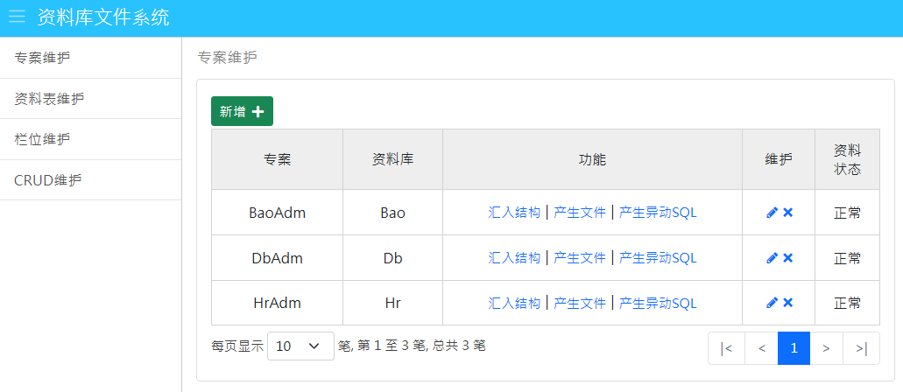

其他语系：[繁中](Readme-TW.md)、[英文](Readme.md)

### 1.专案介绍
DbAdm 是一套资料库文件系统，主画面如下：

使用的开发工具为 ASP.NET Core 6、jQuery 3、Bootstrap 5、Visual Studio 2022 Community，它的功能如下：
- 从现有 MSSQL 的资料库汇入栏位资讯。
- 产生资料库文件档案 Word 档。
- 产生 CRUD 原始码：CRUD 即新增、查询、修改、删除，它代表对资料库的存取动作。
- 产生资料库异动记录 Trigger，它可以用来追踪资料库的异动记录。

### 2.操作画面
进入主画面后，左侧功能表有4个功能项目：
- [专案维护](_md/zh-CN/project.md)
- [资料表维护](_md/zh-CN/table.md)
- [栏位维护](_md/zh-CN/column.md)
- [CRUD维护](_md/zh-CN/myCrud.md)

### 3.下载 & 安装
执行 DbAdm 需要从 GitHub 下载以下两个 Repo 档案，解压缩到本机目录，并且确保 DbAdm 可以正确参照 BaseWeb 专案：
 - Base：包含 Base、BaseApi、BaseWeb、BaseEther 四个专案，内容为基本的公用程式。 DbAdm 必须参照 BaseWeb 专案，下载的网址为 https://github.com/bruce68tw/Base
 - DbAdm：内容为 DbAdm 主程式。

### 4.目录说明
以下是 DbAdm 专案下的目录，其中底线开头的目录表示特殊用途：
 - _data：包含许多工作档案，其中createDb.sql 用来建立本系统的资料表以及产生资料内容；Tables.docx是利用本系统所产生的资料库档案。
 - _log：系统运行所产生 Log 档案。
 - _template：各种功能所需的范本档案。
 - Controllers：Controller类别档案。
 - Enums：列举类别，如果档案名称结尾是Enum表示是数字型，如果是Estr，则表示为字串型，例如：EstrInputType.cs
 - Models：系统所需要Model类别，档案名称后面为Dto表示Data Transfer Object，Vo表示 View Object
 - Resources：多国语资料档案，这里用于View页面。
 - Services：服务类别。
 - Views：网页档案。
 - wwwroot：Web 前端 CSS、JavaScript 档案。
 - Tables：使用 Database First 所产生的 Entity Model。

### 5.组态设定
DbAdm/appsettings.json 里面的 FunConfig 区段记录系统执行时所需要的组态内容，
它包含以下的栏位：
 - Db：标准的资料库连线字串，用于 ADO.NET 和 Entity Framework，并且加入 MultipleActiveResultSets=True 让每一次连线可以多次存取资料库。
 - Locale：指定的多国语语系，目前允许的输入值分别为：zh-TW（繁体中文）、zh-CN（简体中文）、en-US（英文），设定这个栏位，执行时系统即会呈现不同的语系。
 - LogSql：是否记录SQL的内容到 Log 档案，预设false，所有Log档案会存放在 _log 目录底下，这一类的档案名称后缀为 sql。

### 6.建立资料库
DbAdm 的资料库名称为Db，种类为LocalDB、SQL Express、MS SQL 皆可，进入SQL Server Management Studio（SSMS），建立一个空白的资料库Db，然后执行DbAdm/_data/createDb.sql，这个档案会建立以下的资料表和内容，同时在DbAdm/_data/Tables.docx 档案记录它们的栏位定义：
 - Column：栏位资料。
 - Crud：CRUD设定。
 - CrudEitem：CRUD维护资料表的栏位。
 - CrudEtable：CRUD维护资料表。
 - CrudQitem：CRUD查询条件栏位。
 - CrudRitem：CRUD查询结果栏位。
 - Project：专案资料。
 - Table：资料表。
 - XpCode：杂项档，这个资料表用来储存 Key-Value 的对应资料，名称加上Xp表示系统用途。

### 7.参与专案
您可以透过以下方式来参与本专案：
 - 反映系统问题：[GitHub Issues](https://github.com/bruce68tw/DbAdm/issues)
 - 修改程式并且提交请求：[Pull Request](https://github.com/bruce68tw/DbAdm/pulls)
 - 到[脸书](https://www.facebook.com/groups/softblocks)参与讨论。
 - 赠送 GitHub Star。
 - 购买[书籍](https://www.tenlong.com.tw/products/9789865029883)。

### 8.作者
 - Bruce Chen - *Initial work*

### 9.版权说明
本专案使用 [MIT 授权许可](https://zh.wikipedia.org/zh-cn/MIT許可證)。