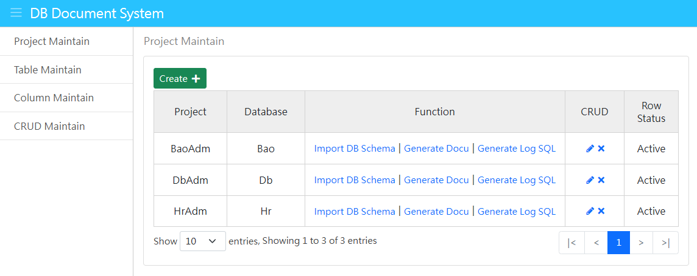

其他語系：[繁中](Readme-TW.md)、[簡中](Readme-CN.md)

### 1. Project introduction
DbAdm is a database file system. The main screen is as follows:

The development tools used are ASP.NET Core 6, jQuery 3, Bootstrap 5, and Visual Studio 2022 Community. Its functions are as follows:
- Import field information from an existing MSSQL database.
- Generate database document file Word file.
- Generate CRUD source code: CRUD means adding, querying, modifying, and deleting. It represents the access actions to the database.
- Generate database transaction record Trigger, which can be used to track database transaction records.

### 2. Operation screen
After entering the main screen, there are 4 function items on the left menu:
- [Project Maintenance](_md/en-US/project.md)
- [Data table maintenance](_md/en-US/table.md)
- [Field Maintenance](_md/en-US/column.md)
- [CRUD Maintenance](_md/en-US/Crud.md)

### 3. Download & Installation
To execute DbAdm, you need to download the following two Repo files from GitHub, extract them to the local directory, and ensure that DbAdm can correctly reference the BaseWeb project:
 - Base: Includes four projects: Base, BaseApi, BaseWeb, and BaseEther, which contain basic utilities. DbAdm must refer to the BaseWeb project, the download URL is https://github.com/bruce68tw/Base
 - DbAdm: The content is the DbAdm main program.

### 4. Directory description
The following are the directories under the DbAdm project, where directories starting with a underscore indicate special purposes:
 - _data: Contains many work files, among which createDb.sql is used to create the data tables of this system and generate data content; Tables.docx is the database file generated by this system.
 - _log: Log files generated by system operation.
 - _template: Template files required for various functions.
 - Controllers: Controller category files.
 - Enums: enumerate categories. If the file name ends with Enum, it means it is a numeric type. If it is Estr, it means it is a string type. For example: EstrInputType.cs
 - Models: Model categories required by the system. The file name is followed by Dto, which represents Data Transfer Object, and Vo, which represents View Object.
 - Resources: Multi-language data files, used here for the View page.
 - Services: Service category.
 - Views: web page files.
 - wwwroot: Web front-end CSS, JavaScript files.
 - Tables: Entity Model generated using Database First.

### 5. Configuration settings
The FunConfig section in DbAdm/appsettings.json records the configuration content required for system execution.
It contains the following fields:
 - Db: Standard database connection string, used in ADO.NET and Entity Framework, and adds MultipleActiveResultSets=True so that each connection can access the database multiple times.
 - Locale: The specified multi-language language. The currently allowed input values ​​are: zh-TW (Traditional Chinese), zh-CN (Simplified Chinese), en-US (English). When this field is set, the system will Different language families will be presented.
 - LogSql: Whether to record the contents of SQL to the Log file. The default is false. All Log files will be stored in the _log directory. The suffix of this type of file name is sql.

### 6. Create database
The database name of DbAdm is Db, and the type can be LocalDB, SQL Express, or MS SQL. Enter SQL Server Management Studio (SSMS), create a blank database Db, and then execute DbAdm/_data/createDb.sql. This file will Create the following data tables and contents, and record their field definitions in the DbAdm/_data/Tables.docx file:
 - Column: field data.
 - Crud: CRUD settings.
 - CrudEitem: CRUD maintenance data table field.
 - CrudEtable: CRUD maintenance data table.
 - CrudQitem: CRUD query condition field.
 - CrudRitem: CRUD query result field.
 - Project: project information.
 - Table: Data table.
 - XpCode: Miscellaneous file. This data table is used to store the corresponding data of Key-Value. The name plus Xp indicates the system purpose.

### 7. Participate in projects
You can participate in this project in the following ways:
 -Reflect system issues: [GitHub Issues](https://github.com/bruce68tw/DbAdm/issues)
 - Modify the program and submit a request: [Pull Request](https://github.com/bruce68tw/DbAdm/pulls)
 - Join the discussion on [Facebook](https://www.facebook.com/groups/softblocks).
 - Give away GitHub Stars.
 - Purchase [Book](https://www.tenlong.com.tw/products/9789865029883).

### 8. Author
 - Bruce Chen - *Initial work*

### 9. Copyright statement
This project uses the [MIT License](https://en.wikipedia.org/wiki/MIT_License).