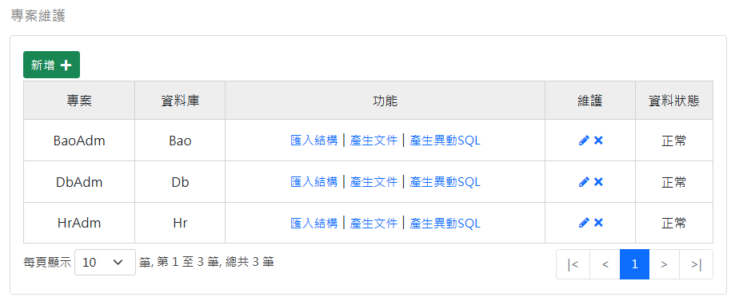
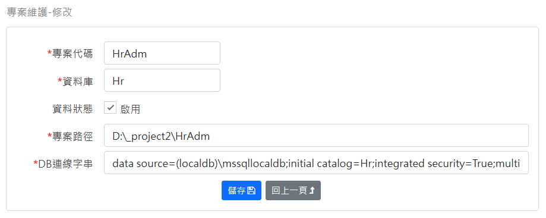

### 查詢畫面
查詢 Project 資料表：

- 從現有 MSSQL 的資料庫匯入欄位資訊。
- 產生資料庫文件檔案 Word 檔。
- 產生 CRUD 原始碼：CRUD 即新增、查詢、修改、刪除，它代表對資料庫的存取動作。
- 產生資料庫異動記錄 Trigger，它可以用來追蹤資料庫的異動記錄。

### 維護畫面
維護 Project 資料表：

進入主畫面後，左側功能表有4個功能項目：
- [專案維護](_docu/project.md)
- [資料表維護]()
- [欄位維護]()
- [CRUD維護]()
