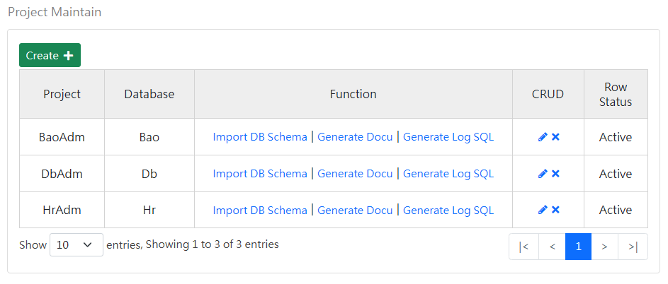
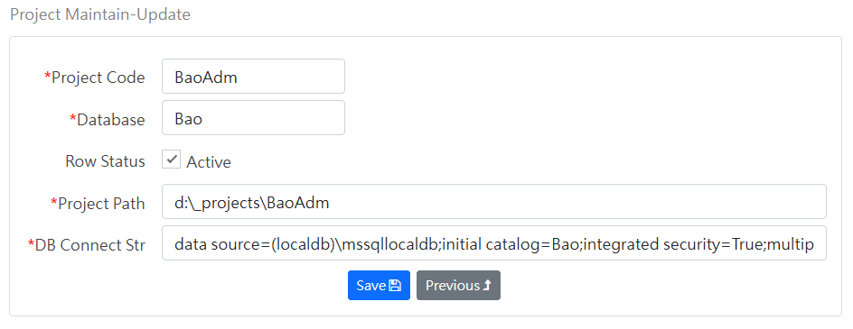

[Back to home page](../../Readme.md)
### Project Maintenance-Query Screen
Query the Project data table:

Function field description:
- Import structure: Import field information from an existing MSSQL database.
- Generate file: generate database file Word file.
- Generate transaction SQL: Generate database transaction record Trigger, which can be used to track database transaction records.

### Maintenance screen
Maintain Project data table:

Field Description:
- Project code: Use this code as namespace when generating CRUD programs
- Database: Use this database when importing structures.
- Data status: Inactive data will be ignored.
- Project path: the path when generating the CRUD program.
- DB connection string: Use this connection string when importing the structure.