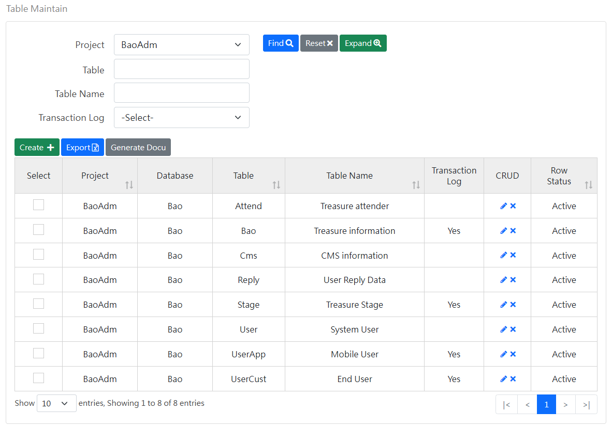
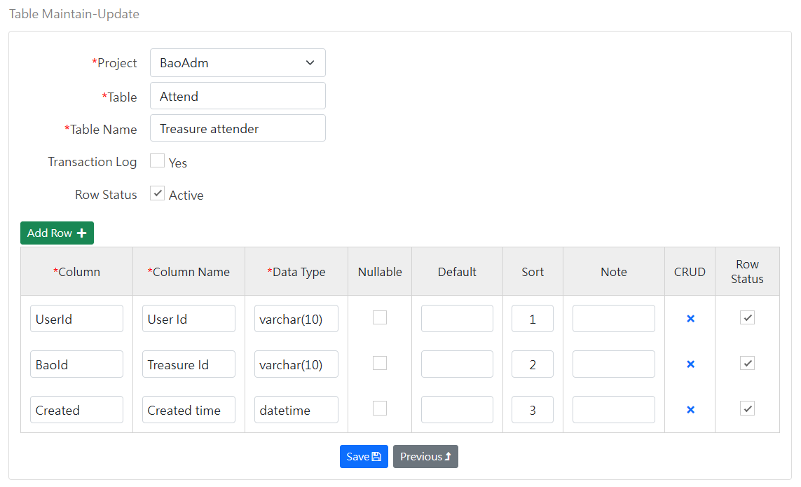

[Back to home page](../../Readme.md)
### Data table maintenance-query screen
Query Table data table:

Function button description:
- Export: Export the query result data to an excel file.
- Generate file: Generate a file file from the selected data table.

### Maintenance screen
Maintain Table (top) and Column (bottom) data tables:

Special field description:
- Transaction record: If checked, the transaction Trigger SQL generated will include this data table.