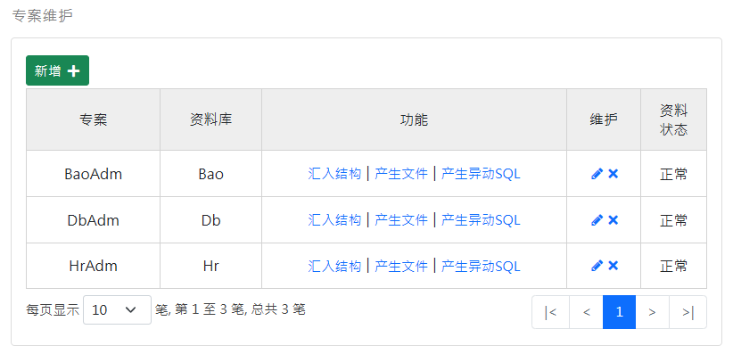
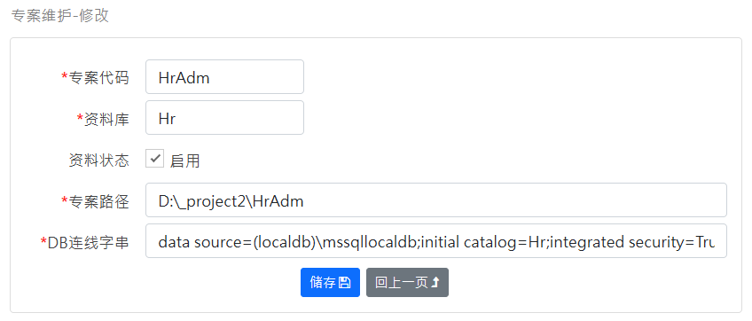

[回首页](../../Readme-CN.md)
### 专案维护-查询画面
查询 Project 资料表：

功能栏位说明：
- 汇入结构：从现有 MSSQL 的资料库汇入栏位资讯。
- 产生文件：产生资料库文件档案 Word 档。
- 产生异动SQL：产生资料库异动记录 Trigger，它可以用来追踪资料库的异动记录。

### 维护画面
维护 Project 资料表：

栏位说明：
- 专案代码：产生CRUD程式时使用此代码做为namespace
- 资料库：汇入结构时使用此资料库。
- 资料状态：系统会略过停用的资料。
- 专案路径：产生CRUD程式时的路径。
- DB连线字串：汇入结构时使用此连线字串。