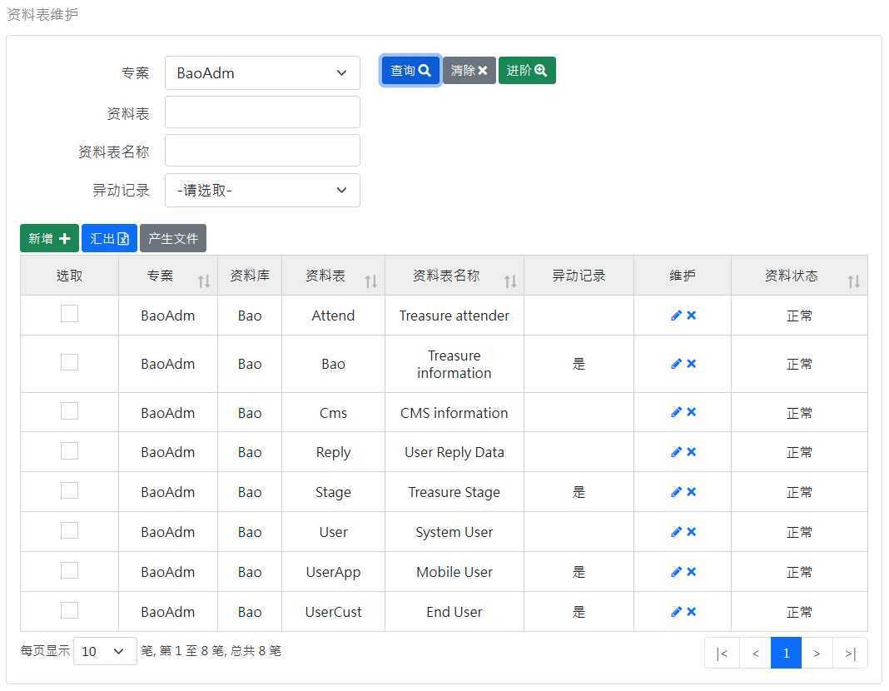
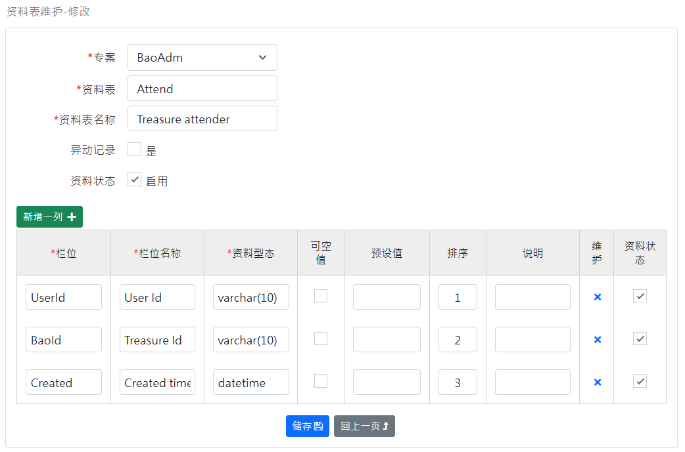

[回首页](../../Readme-CN.md)
### 资料表维护-查询画面
查询 Table 资料表：

功能按钮说明：
- 汇出：将查询结果资料汇出 excel 档案。
- 产生文件：将选取的资料表产生文件档案。

### 维护画面
维护 Table(上方)、Column(下方) 资料表：

特殊栏位说明：
- 异动记录：如果勾选则产生的异动 Trigger SQL 会包含此资料表。