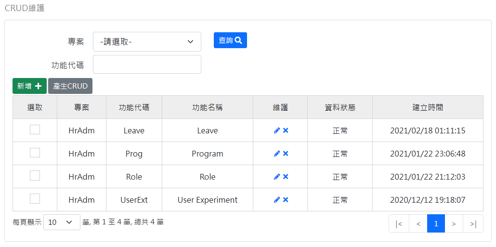
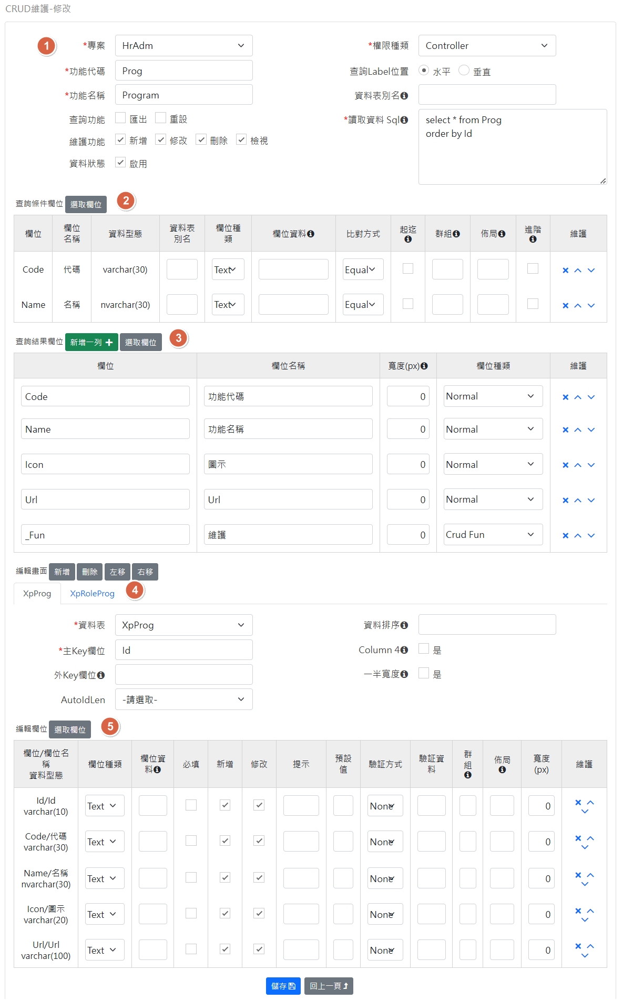

[回首頁](../../Readme-tw.md)
### CRUD維護-查詢畫面
查詢 Crud 資料表：

功能按鈕說明：
- 匯出：將查詢結果資料匯出 excel 檔案。
- 產生文件：將選取的資料表產生文件檔案。

### 維護畫面
維護 Crud、CrudQitem、CrudRitem、CrudEtable、CrudEitem 資料表：

特殊欄位說明：
- 異動記錄：如果勾選則產生的異動 Trigger SQL 會包含此資料表。