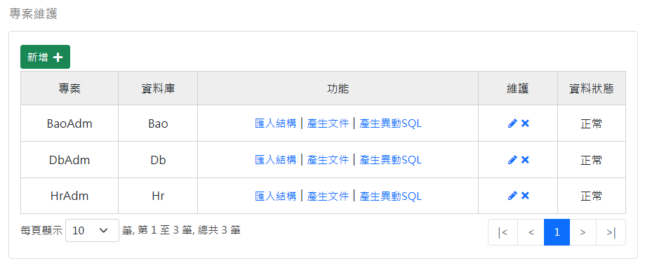
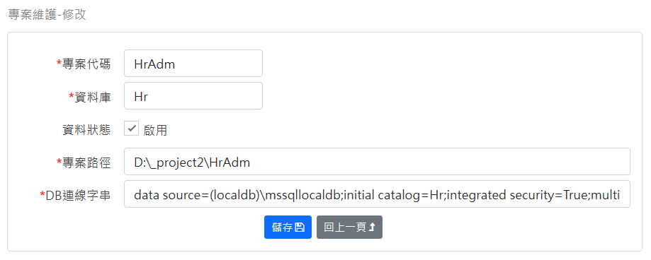

[回首頁](../../Readme-tw.md)
### 專案維護-查詢畫面
查詢 Project 資料表：

功能欄位說明：
- 匯入結構：從現有 MSSQL 的資料庫匯入欄位資訊。
- 產生文件：產生資料庫文件檔案 Word 檔。
- 產生異動SQL：產生資料庫異動記錄 Trigger，它可以用來追蹤資料庫的異動記錄。

### 維護畫面
維護 Project 資料表：

欄位說明：
- 專案代碼：產生CRUD程式時使用此代碼做為namespace
- 資料庫：匯入結構時使用此資料庫。
- 資料狀態：系統會略過停用的資料。
- 專案路徑：產生CRUD程式時的路徑。
- DB連線字串：匯入結構時使用此連線字串。